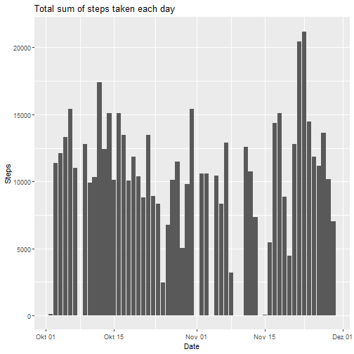
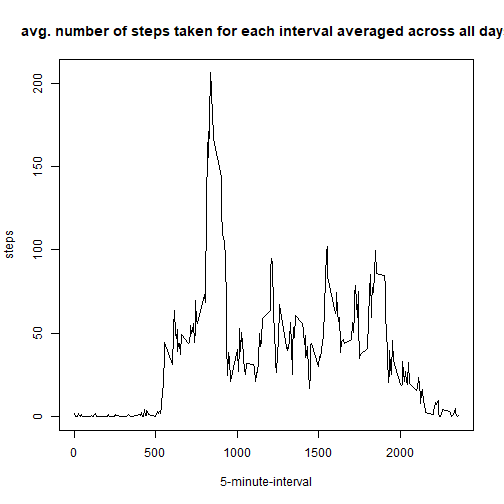
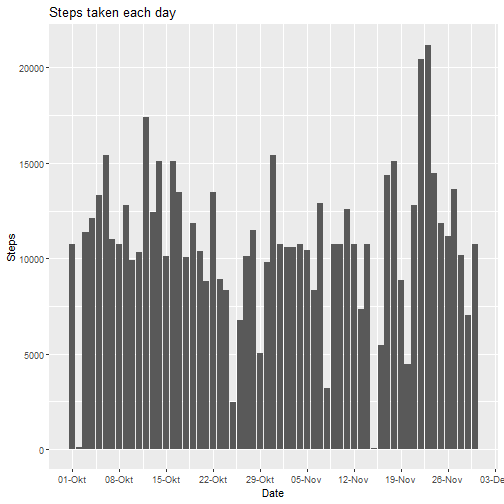
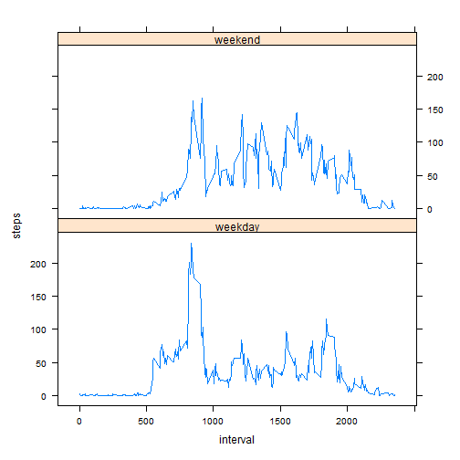

We will use the following packages to complete the peer-graded assignment.

```r
library(dplyr)
library(ggplot2)
library(lattice)
```

## Loading and preprocessing the data

#### 1. Load the data (i.e. read.csv())

```r
data <- read.csv("activity.csv")
```

#### 2. Process/transform the data (if necessary) into a format suitable for your analysis

```r
# converting the "date" column to Date format
data$date <- as.Date(data$date)
```
## What is mean total number of steps taken per day?

#### 1. Calculate the total number of steps taken per day

```r
# calculate total sum of steps taken each day
steps_each_day <- data %>%
    group_by(date) %>%
    summarise_all(sum)
```

#### 2. If you do not understand the difference between a histogram and a barplot, research the difference between them. Make a histogram of the total number of steps taken each day

```r
# create histogram showcasing the total sum of steps taken by day
ggplot(steps_each_day, aes(x = date, y = steps)) +
    geom_histogram(stat = "identity") +
    labs(x = "Date", y = "Steps", title = "Total sum of steps taken each day")
```



#### 3. Calculate and report the mean and median of the total number of steps taken per day

```r
mean(steps_each_day$steps, na.rm = TRUE)
```

```
## [1] 10766.19
```

```r
median(steps_each_day$steps, na.rm = TRUE)
```

```
## [1] 10765
```

## What is the average daily activity pattern?


```r
## 1. Make a time series plot (i.e. type = "l") of the 5-minute interval 
## (x-axis) and the average number of steps taken, averaged across 
## all days (y-axis)

# calculate total sum of steps taken for each interval across all days
steps_by_interval <- data[, -2] %>%
    group_by(interval) %>%
    summarise(steps = mean(steps, na.rm = TRUE))

# create time series plot of the 5-minute interval and the average number 
# of steps taken, averaged across all days
plot(steps_by_interval$interval, steps_by_interval$steps, type = "l", 
     xlab = "5-minute-interval", ylab = "steps", 
     main = "avg. number of steps taken for each interval averaged across all days")
```



#### 2. Which 5-minute interval, on average across all the days in the dataset, contains the maximum number of steps?

```r
# determine 5-minute-interval containing the maximum averaged number of steps
# across all days
steps_by_interval[which.max(steps_by_interval$steps),]
```

```
## # A tibble: 1 x 2
##   interval steps
##      <int> <dbl>
## 1      835  206.
```

## Imputing missing values 

#### 1. Calculate and report the total number of missing values in the dataset (i.e. the total number of rows with NAs)

```r
length(data[is.na(data$steps), 1])
```

```
## [1] 2304
```

#### 2. Devise a strategy for filling in all of the missing values in the dataset. The strategy does not need to be sophisticated. For example, you could use the mean/median for that day, or the mean for that 5-minute interval, etc.

```r
# If a value is missing for an interval, we will fill in the missing value with
# the mean for that specific intervall
```

#### 3. Create a new dataset that is equal to the original dataset but with the missing data filled in.

```r
a <- data

for(i in 1:nrow(a)){
    if(is.na(a[i,1] == TRUE)){
        a[i,1] <- steps_by_interval[steps_by_interval[,1] == a[i,3], 2]
    } else{
        next 
    }
}

filled_NA <- a
rm(a)
```

#### 4. Make a histogram of the total number of steps taken each day and Calculate and report the mean and median total number of steps taken per day. Do these values differ from the estimates from the first part of the assignment? What is the impact of imputing missing data on the estimates of the total daily number of steps?


```r
# calculate total sum of steps taken each day
steps_each_day <- filled_NA %>%
    group_by(date) %>%
    summarise_all(sum)

# create histogram showcasing the total sum of steps taken by day
ggplot(steps_each_day, aes(x = date, y = steps)) +
    geom_col() +
    scale_x_date(date_breaks = "1 week", date_labels = "%d-%b") +
    labs(x = "Date", y = "Steps", title = "Steps taken each day")
```



Histogram only differs at days that only had NA values


```r
# calculate mean and median of total number of steps taken per day
mean(steps_each_day$steps, na.rm = TRUE)
```

```
## [1] 10766.19
```

```r
median(steps_each_day$steps, na.rm = TRUE)
```

```
## [1] 10766.19
```
The mean doesn't differ, while the median does. The mean doesn't differ, because we filled in the missing values with the mean for the according interval. For this example the median only differs by 1 unit, but this can change for different data sets.

## Are there differences in activity patterns between weekdays and weekends?

#### 1. Create a new factor variable in the dataset with two levels – “weekday” and “weekend” indicating whether a given date is a weekday or weekend day.


```r
filled_NA$week_day_end <- "weekday"

filled_NA[weekdays(filled_NA[,2]) %in% c("Samstag", "Sonntag"), 4] <- "weekend"

filled_NA$week_day_end <- as.factor(filled_NA$week_day_end)
```

#### 2. Make a panel plot containing a time series plot (i.e. type = "l") of the 5-minute interval (x-axis) and the average number of steps taken, averaged across all weekday days or weekend days (y-axis). See the README file in the GitHub repository to see an example of what this plot should look like using simulated data.


```r
steps_by_wde_interval <- filled_NA[, -2] %>%
    group_by(week_day_end, interval) %>%
    summarise(steps = mean(steps, na.rm = TRUE))

xyplot(steps ~ interval | week_day_end, data = steps_by_wde_interval, 
       layout = c(1,2), type = "l")
```



<details>
  <summary>Click to open complete code</summary>

```r
library(dplyr)
library(ggplot2)
library(lattice)

####### Loading and preprocessing the data #######

## 1. Load the data (i.e. read.csv())
data <- read.csv("activity.csv")

## 2. Process/transform the data (if necessary) into a format suitable for your analysis
# converting the "date" column to Date format
data$date <- as.Date(data$date)

####### What is mean total number of steps taken per day? #######

## 1. Calculate the total number of steps taken per day

# calculate total sum of steps taken each day
steps_each_day <- data %>%
    group_by(date) %>%
    summarise_all(sum)

## 2. If you do not understand the difference between a histogram and a barplot,
## research the difference between them. Make a histogram of the total number of
## steps taken each day

# create histogram showcasing the total sum of steps taken by day
ggplot(steps_each_day, aes(x = date, y = steps)) +
    geom_histogram(stat = "identity") +
    labs(x = "Date", y = "Steps", title = "Total sum of steps taken each day")

## 3. Calculate and report the mean and median of the total number of steps 
## taken per day
mean(steps_each_day$steps, na.rm = TRUE)
median(steps_each_day$steps, na.rm = TRUE)

####### What is the average daily activity pattern? #######

## 1. Make a time series plot (i.e. type = "l") of the 5-minute interval 
## (x-axis) and the average number of steps taken, averaged across 
## all days (y-axis)

# calculate total sum of steps taken for each interval across all days
steps_by_interval <- data[, -2] %>%
    group_by(interval) %>%
    summarise(steps = mean(steps, na.rm = TRUE))

# create time series plot of the 5-minute interval and the average number 
# of steps taken, averaged across all days
plot(steps_by_interval$interval, steps_by_interval$steps, type = "l", 
     xlab = "5-minute-interval", ylab = "steps", 
     main = "avg. number of steps taken for each interval averaged across all days")

## 2. Which 5-minute interval, on average across all the days in the dataset, 
## contains the maximum number of steps?

# determine 5-minute-interval containing the maximum averaged number of steps
# across all days
steps_by_interval[which.max(steps_by_interval$steps),]

####### Imputing missing values #######

## 1. Calculate and report the total number of missing values in the dataset 
## (i.e. the total number of rows with NAs)
length(data[is.na(data$steps), 1])

## 2. Devise a strategy for filling in all of the missing values in the dataset.
## The strategy does not need to be sophisticated. For example, you could use 
## the mean/median for that day, or the mean for that 5-minute interval, etc.

# If a value is missing for an interval, we will fill in the missing value with
# the mean for that specific intervall

## 3. Create a new dataset that is equal to the original dataset but with the 
## missing data filled in.

a <- data

for(i in 1:nrow(a)){
    if(is.na(a[i,1] == TRUE)){
        a[i,1] <- steps_by_interval[steps_by_interval[,1] == a[i,3], 2]
    } else{
        next 
    }
}

filled_NA <- a
rm(a)

## 4. Make a histogram of the total number of steps taken each day and Calculate
## and report the mean and median total number of steps taken per day. Do these 
## values differ from the estimates from the first part of the assignment? What 
## is the impact of imputing missing data on the estimates of the total daily 
## number of steps?

# calculate total sum of steps taken each day
steps_each_day <- filled_NA %>%
    group_by(date) %>%
    summarise_all(sum)

# create histogram showcasing the total sum of steps taken by day
ggplot(steps_each_day, aes(x = date, y = steps)) +
    geom_col() +
    scale_x_date(date_breaks = "1 week", date_labels = "%d-%b") +    
    labs(x = "Date", y = "Steps", title = "Steps taken each day")

# histogram only differs at days that only had NA values

# calculate mean and median of total number of steps taken per day
mean(steps_each_day$steps, na.rm = TRUE)
median(steps_each_day$steps, na.rm = TRUE)

# the mean doesn't differ, while the median does. The mean doesn't differ,
# because we filled in the missing values with the mean for the according
# interval. For this example the median only differs by 1 unit, but this can
# be different for different data sets.

####### Are there differences in activity patterns between weekdays and weekends? #######

## 1. Create a new factor variable in the dataset with two levels – “weekday” 
## and “weekend” indicating whether a given date is a weekday or weekend day.
filled_NA$week_day_end <- "weekday"

filled_NA[weekdays(filled_NA[,2]) %in% c("Samstag", "Sonntag"), 4] <- "weekend"

filled_NA$week_day_end <- as.factor(filled_NA$week_day_end)

## 2. Make a panel plot containing a time series plot (i.e. type = "l") of the 
## 5-minute interval (x-axis) and the average number of steps taken, averaged 
## across all weekday days or weekend days (y-axis). See the README file in the 
## GitHub repository to see an example of what this plot should look like using 
## simulated data.

steps_by_wde_interval <- filled_NA[, -2] %>%
    group_by(week_day_end, interval) %>%
    summarise(steps = mean(steps, na.rm = TRUE))

xyplot(steps ~ interval | week_day_end, data = steps_by_wde_interval, 
       layout = c(1,2), type = "l")
```
</details>

#### Thanks for reading my assignment!


